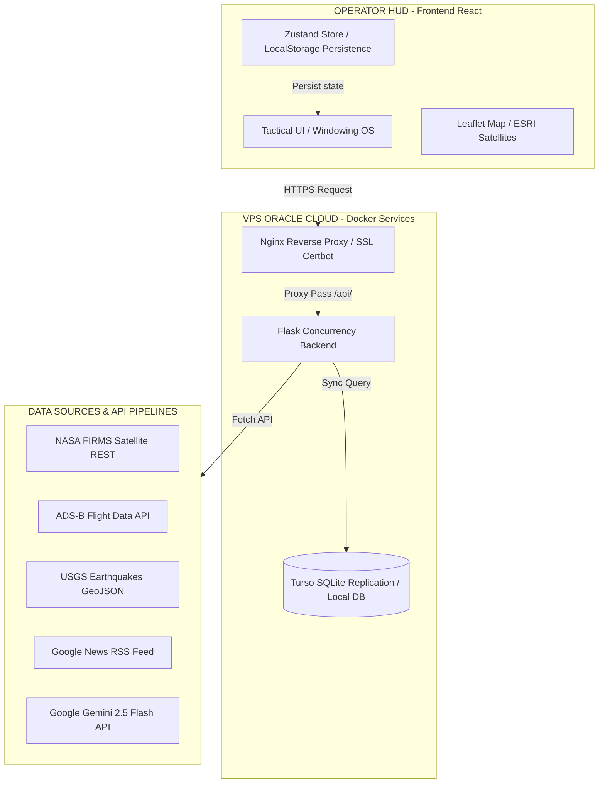

# 🐦 RAVEN-X: AI-Powered Multi-Domain Command & Control System
### *Real-Time Geospatial Intelligence, Spatiotemporal Data Engineering & Agentic LLM Diagnostics*

---

## 📌 GIỚI THIỆU CHUNG (PROJECT OVERVIEW)
**RAVEN-X** là một hệ thống Trạm Chỉ huy Tình báo Đa nhiệm (Multi-Domain Command & Control System) mô phỏng theo ngôn ngữ thiết kế của các hệ thống tình báo cao cấp (như Palantir Gotham). Dự án được thiết kế và phát triển bởi sinh viên ngành **Trí tuệ Nhân tạo & Khoa học Dữ liệu**, tập trung vào việc xử lý các bài toán:
*   **Agentic Workflow & LLM Reasoning:** Tự động hóa phân tích tình báo chiến lược sử dụng các mô hình ngôn ngữ lớn (LLM).
*   **Spatiotemporal Data Engineering:** Thu thập, chuẩn hóa và biểu diễn dữ liệu không gian - thời gian thực từ các nguồn dữ liệu vệ tinh, địa chất và hàng không toàn cầu.
*   **High-Concurrency Pipelines:** Xây dựng hệ thống thu thập dữ liệu bất đồng bộ hiệu năng cao chạy ổn định trên cấu hình VPS Cloud tối giản (Free-tier).

---

## 🧠 CÁC TRỤ CỘT AI & KHOA HỌC DỮ LIỆU (AI & DATA SCIENCE PILLARS)

### 1. Tác Tử Phân Tích Chiến Lược (Agentic Intel Analyst)
Hệ thống tích hợp một **AI Agent** sử dụng mô hình **Gemini 2.5 Flash** làm nòng cốt để tự động hóa quy trình phân tích và viết Báo cáo Tình hình Chiến dịch (SITREP - Situation Report):
*   **Context-Injection Pipeline:** Tự động gom toàn bộ trạng thái viễn trắc (telemetry) của hệ thống bao gồm: vị trí Operator (GPS), danh sách safehouses, các đám cháy vệ tinh lớn, sự cố Internet, nhiễu GPS và lệnh truy nã Interpol hoạt động.
*   **Prompt Engineering & Agentic Reasoning:** Ép AI phân tích chéo (cross-reference) mối tương quan giữa các sự kiện địa chính trị và thiên tai để đưa ra cảnh báo sớm về các mối đe dọa tiềm ẩn (Threat Matrix).

### 2. Xử Lý Luồng Dữ Liệu Không Gian - Thời Gian (Spatiotemporal Analytics)
*   **Outlier & Noise Filtering (Lọc nhiễu vệ tinh NASA FIRMS):** Dữ liệu nhiệt lượng bề mặt trái đất được lọc qua bộ lọc heuristc: chỉ hiển thị các điểm có năng lượng bức xạ nhiệt (FRP - Fire Radiative Power) $> 500\text{ MW}$ để cô lập các đám cháy rừng hoặc các vụ nổ xung đột lớn, triệt tiêu tín hiệu nhiễu rác từ hoạt động dân sự.
*   **Geofencing & Collision Detection:** Cho phép vẽ các vùng cấm (Geofence) và tính toán khoảng cách không gian (Rangefinder) thời gian thực trên nền bản đồ phân giải cao (Esri World Imagery).

### 3. Trích Xuất Tri Thức Từ Nguồn Tin Mở (OSINT & NLP Regex Interception)
*   **Text Mining & Intent Categorization:** Dữ liệu tin tức báo chí toàn cầu được crawl thông qua Google News RSS, sau đó bộ máy phân tích NLP Regex sẽ phân loại các bài báo vào các danh mục tác chiến cụ thể như `Cyber Attack` (nếu chứa các từ khóa ransomware, hacker, DDoS) hoặc `Sabotage` (phá hoại hạ tầng vật lý).
*   **Interpol Database Integration:** Tự động hóa API truy vấn dữ liệu các đối tượng truy nã đỏ (Interpol Red Notices), hỗ trợ tra cứu lý lịch tội phạm chiến tranh và tội phạm công nghệ cao theo thời gian thực.

---

## 🏗️ KIẾN TRÚC HỆ THỐNG (SYSTEM ARCHITECTURE)



*   **Concurrency & Performance Optimization:** Backend Flask triển khai đa luồng (`ThreadPoolExecutor`) giúp thu thập tin tức, dữ liệu thời tiết của hàng trăm quốc gia song song mà không nghẽn luồng chính. Tích hợp cache ngắn hạn để tối ưu chi phí API.
*   **Zero-Downtime Database:** Sử dụng **Turso Cloud (libSQL)** đồng bộ dữ liệu người dùng và cấu hình trạm chỉ huy linh hoạt, hỗ trợ chế độ ngoại tuyến (fallback về tệp SQLite cục bộ `ravenx.db` trên VPS Oracle khi mất mạng).

---

## ⚡ HƯỚNG DẪN CHẠY LOCAL & TRIỂN KHAI VPS (DEPLOYMENT PROTOCOL)

### 1. Chạy Thử Ở Local (Local Sandbox)
Chạy trực tiếp trên Windows bằng script tự động hóa:
1. Đảm bảo máy tính đã cài đặt Python 3.10+ và Node.js.
2. Click đúp vào file `start.bat`. Script sẽ tự động:
   * Cài đặt dependencies cho Python Backend (`backend/requirements.txt`).
   * Khởi động Flask server trên port `http://localhost:5000`.
   * Khởi động frontend Vite trên port `http://localhost:5173`.
   * Tự động mở trình duyệt truy cập hệ thống chỉ huy.

### 2. Triển Khai Lên VPS Oracle (Production Cloud Docker)
Dự án đã được container hóa hoàn chỉnh bằng **Docker Compose** và điều phối qua **Nginx Reverse Proxy**:

1. Cấu hình biến môi trường production trong `tactical-ui/.env.production`:
   ```env
   VITE_BACKEND_URL=https://ravenx-protocol.duckdns.org
   ```
2. Build và khởi động các container bằng Docker Compose trên VPS Oracle:
   ```bash
   docker-compose up --build -d
   ```
3. Cấu hình chứng chỉ SSL Let's Encrypt cho tên miền của bạn thông qua volume `/etc/letsencrypt` kết nối trực tiếp với Nginx để bảo mật giao thức truyền tin (AES-GCM-256).

---

## 🛡️ TÌNH TRẠNG CLEARANCE & KỶ LUẬT AN NINH MẠNG
*   **Mức Độ Bảo Mật:** `TOP SECRET // SCI (Sensitive Compartmented Information)`
*   **Phát Triển Độc Lập:** Hệ thống thiết kế khép kín cho 1 Operator duy nhất điều hành thực địa (Single-Operator Mode), tích hợp lưu trữ an toàn trạng thái vận hành trên LocalStorage để ngăn ngừa mất dấu vị trí tác chiến kể cả khi mất kết nối đột ngột hoặc Reload F5.

---
<div align="center">
  <code>[SYSTEM SECURITY PROTOCOL IS OPERATIONAL // RAVEN-X PROJECT]</code>
</div>
